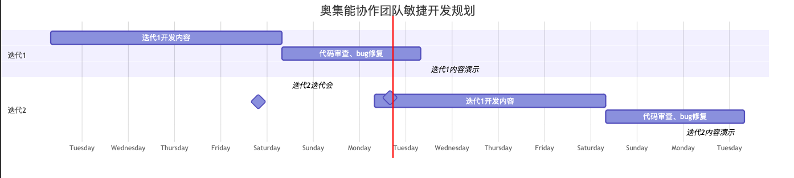

# 敏捷开发

## DoD： 完成的定义

> 错误示范：表单设计器架构完成

> 正确做法：完成框架。单位管理员可以在首页添加新页面，在新页面中插入商品展示组件，该组件展示内容通过关联表单及字段完成，页面包含商品列表、搜索、分类、商品详情。注意：不能定制化做该页面，需要在设计器框架中，以组件方式提供。

## 共享进度

采用Github Issues：

https://github.com/Orginone/oiocns-react/issues

后续会补充具体迭代规则

## 迭代规划

每周一次迭代，每周迭代内容周六发布。

- 周一迭代开始
- 周五完成开发并提交代码，冗余至周六晚上
- 周六至周二杨老师合并代码并发布
- 周三迭代演示

## 每日站会

- 每个工作日 下午4点
- 形式：共享看板内容，对着看板每个人说出以下内容
  - 昨日完成什么任务？
  - 今日准备完成什么任务？
  - 遇到什么困难
    - 如果有困难问题需要杨老师或者其他人员协助解决，站会完成后继续讨论。其余人可以选择参与或不参与
- 时长不超过15分钟
- 高效！高效！高效！

## 每周迭代会

- 初步确定周五下午4点。
- 规划好的下周用户故事，大家一起规划下周要完成的大的用户故事。
- 认领完毕后需要大家自行拆解任务。任务大小尽可能控制在半天能完成的维度
- 拆解过程不需要在迭代会提现，在周一早上站会之前拆分完成即可

## 每周三演示会

- 周三例会中需要用正式站点演示上周迭代内容
- 能够完成整体工作流程
- 演示会最好安排在第一议程，好让敏捷开发团队提前下线继续开发内容

